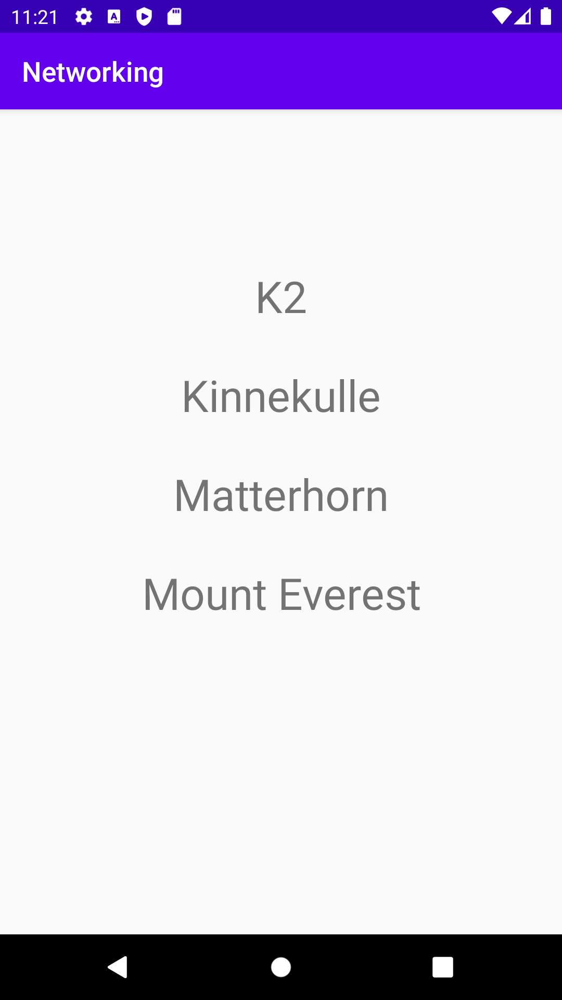

# Rapport

En `RecycleView` implementerades genom att lägga till en widget i `activity_main.xml` och sedan skapa en layout-fil som kallas `recycler_view_item.xml` som bestämmer layouten av varje rad i listan. Fortsättningsvis så skapades klassen `Mountain` som innehåller attribut och en metod relaterade till berg som ska listas. 

För att hantera en `RecycleView` så används en adapter klass som identifieras som `RecycleViewAdapter`. Denna klass instansieras i `MainActivity` och då skickas bland annat en `ArrayList` med som argument. Denna array innehåller de `Mountain` objekt som ska användas för att visa listan med bergens namn. Klassen används som adapter för den `RecycleView` som instansieras i `MainAcitivty` och som refererar till den `RecycleView` widget som lagts till i `activity_main.xml`.

`ViewHolder` är en klass som representerar varje rad av listan i `RecycleView`:en. Nedan visas konstruktorn för `ViewHolder` och att den bestämmer texten för en `TextView` med hjälp av en `String` som skickas som argument. Denna `String` är i detta fallet namnet på ett berg. 

```java
TextView name;

ViewHolder(View itemView) {
    super(itemView);
    itemView.setOnClickListener(this);
    name = itemView.findViewById(R.id.mountain_name);
}
```

I `MainActivity` hämtas en JSON array från internet genom att använda `JsonTask` klassen. JSON hanteras sedan i `onPostExecute` metoden i `MainActivity`. Nedan visas hur denna metod implementerats.

```java
    @Override
    public void onPostExecute(String json) {
        Log.d("MainActivity", json);

        try {
            JSONArray jsonArray = new JSONArray(json);

            for (int i = 0; i < jsonArray.length();i++){
                JSONObject jsonObj = (JSONObject) jsonArray.get(i); // get object
                String name = jsonObj.getString("name"); // get name of mountain
                Log.d("onPost", name);
                mountains.add(new Mountain(name));
            }

        } catch (JSONException e) {
            throw new RuntimeException(e);
        }

        recycleViewAdapter.notifyDataSetChanged(); //update RecycleView

    }
```
I `onPostExecute` metoden så initieras en `JSONArray` med hjälp av den `String` som skickats som argument. Denna array innehåller då fyra olika `JSONObject` som representerar varje berg. Genom att iterera arrayen så hämtas attributet "name" från varje `JSONObject` och sedan skapas en ny instans av `Mountain` som läggs till i den `ArrayList` som sparar det som ska listas i `RecycleView`:en. Sista delen av metoden notifierar adaptern om att listan blivit uppdaterad med ny information. Detta gör att bergens namn visas i användargränssnittet. 

Nedan visas en bild på hur användargränssnittet ser ut i applikationen.

</img>


